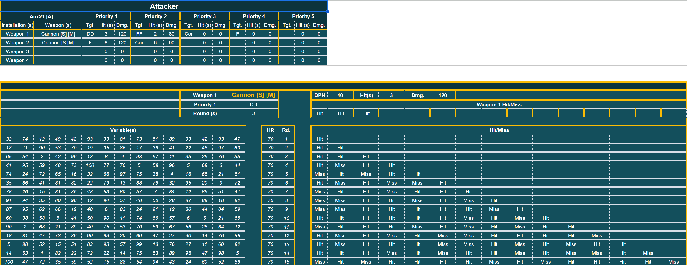

# jLaHire IFL toolkit

## TL;DR

This is a collection of tools I made for the game Infinite Lagrange back when I actively played the game. All of them are out dated as of 10/2024 and they are shared here for posterity and for others to build upon.

## Extras

Most of the tools I made in excel have an accompanying google form.
Example: [map input](https://docs.google.com/forms/d/1LYQ7Kc_QAJfG-g5FKnJrw3D_krYfFzRg1UXXfcqIGUQ/edit)
Data entered on this form links to the IFL+MAP+Public+Release.xlsx tool. It is very easy to link a form to the google sheets, a quick search on google will give you the steps to make your own.

## Acheivements

The biggest acheivement I had was figuring out how to simulate the accuracy of all the weapons in-game. It definitely took a long time to figure out how certain things worked in the game and then even longer to figure out how to simulate those in-game logics in a excel spreadsheet.  After recording and comparing a few hundred battle reports I realized I could simulate the accuracy using the monte carlo method in excel and end up with a 80-90% accurancy between sim battle report and in-game battle report.



## File Formats

### Excel Files (.xlsx)

- **Download and use**
- Complete functionality with formulas and calculations
- Formatted for easy data entry
- Can be integrated with appsheets easily [see example](https://www.appsheet.com/start/e839d64a-d25f-41ca-bfa9-349a86d1408b#appName=Kumo-Map-1001559595&group=%5B%5D&sort=%5B%5D&table=Totals&view=Kill+Count)

### CSV Files (.csv)

- **Viewable on github**
- Easy to update/export

## File tree

```text
|-- README.md
|-- battle-sys
|   |-- WIP_BS.xlsx
|   `-- data
|       |-- ships.csv
|       `-- wepons.csv
|-- calculators
|   |-- lahire-base-calc-rev03.xlsx
|   `-- speed_damage.xlsx
|-- group-mgm
|   |-- Swarm.xlsx
|   `-- data
|       `-- members.csv
|-- image.png
|-- map
|   `-- IFL+MAP+Public+Release.xlsx
`-- tournaments
    |-- IFL Tournament 1.xlsx
    `-- data
        `-- results.csv

8 directories, 12 files
```
